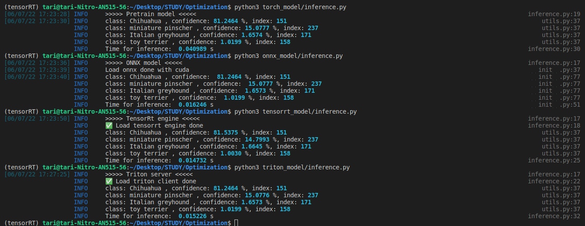

# Speed Up Model

## 1. Setup 
### 1.1. Hardware
- Acer Nitro 5
- Ram 8GB
- GTX 1650 4GB
- Nvidia-driver: 470 - cuda 11.4
### 1.2. Install Some package
#### Install [cuda-toolkit 11.4](https://developer.nvidia.com/cuda-11-4-1-download-archive)
```
wget https://developer.download.nvidia.com/compute/cuda/repos/ubuntu2004/x86_64/cuda-ubuntu2004.pin
sudo mv cuda-ubuntu2004.pin /etc/apt/preferences.d/cuda-repository-pin-600
wget https://developer.download.nvidia.com/compute/cuda/11.4.1/local_installers/cuda-repo-ubuntu2004-11-4-local_11.4.1-470.57.02-1_amd64.deb
sudo dpkg -i cuda-repo-ubuntu2004-11-4-local_11.4.1-470.57.02-1_amd64.deb
sudo apt-key add /var/cuda-repo-ubuntu2004-11-4-local/7fa2af80.pub
sudo apt-get update
sudo apt-get -y install cuda
```
#### Install [cuDNN-8.2.4](https://developer.nvidia.com/cudnn)
```
sudo dpkg -i libcudnn8_8.2.4.15-1+cuda11.4_amd64.deb
sudo dpkg -i libcudnn8-dev_8.2.4.15-1+cuda11.4_amd64.deb
# Verify install cuDNN
cat /usr/include/x86_64-linux-gnu/cudnn_v*.h | grep CUDNN_MAJOR -A 2 
```
#### Install [TensorRT-8.2.0](https://developer.nvidia.com/tensorrt)
```
sudo dpkg -i nv-tensorrt-repo-ubuntu2004-cuda11.4-trt8.2.0.6-ea-20210922_1-1_amd64.deb
sudo apt update
sudo apt install tensorrt
pip install nvidia-pyindex
pip install nvidia-tensorrt
```
#### Add PATH to /.bashrc
```
nano ~/.bashrc
export CUDA_HOME=/usr/local/cuda
export DYLD_LIBRARY_PATH=$CUDA_HOME/lib64:$DYLD_LIBRARY_PATH
export PATH=$CUDA_HOME/bin:$PATH
export C_INCLUDE_PATH=$CUDA_HOME/include:$C_INCLUDE_PATH
export CPLUS_INCLUDE_PATH=$CUDA_HOME/include:$CPLUS_INCLUDE_PATH
export LD_LIBRARY_PATH=$CUDA_HOME/lib64:$LD_LIBRARY_PATH
export LD_RUN_PATH=$CUDA_HOME/lib64:$LD_RUN_PATH
export PYTHONPATH=.
```
#### Install [container-nvidia](https://docs.nvidia.com/datacenter/cloud-native/container-toolkit/install-guide.html)
```
curl https://get.docker.com | sh && sudo systemctl --now enable docker

distribution=$(. /etc/os-release;echo $ID$VERSION_ID) \
    && curl -fsSL https://nvidia.github.io/libnvidia-container/gpgkey | sudo gpg --dearmor -o /usr/share/keyrings/nvidia-container-toolkit-keyring.gpg \
    && curl -s -L https://nvidia.github.io/libnvidia-container/$distribution/libnvidia-container.list | \
    sed 's#deb https://#deb [signed-by=/usr/share/keyrings/nvidia-container-toolkit-keyring.gpg] https://#g' | \
    sudo tee /etc/apt/sources.list.d/nvidia-container-toolkit.list

sudo apt-get update
sudo apt-get install -y nvidia-docker2
sudo systemctl restart docker
# Verify install
sudo docker run --rm --gpus all nvidia/cuda:11.4.0-base-ubuntu20.04 nvidia-smi
```
#### Install [triton-server](https://github.com/triton-inference-server/server/blob/main/docs/quickstart.md#install-triton-docker-image)
```
docker pull nvcr.io/nvidia/tritonserver:22.05-py3
docker pull nvcr.io/nvidia/tritonserver:22.05-py3-sdk

# verify triton-server
git clone https://github.com/triton-inference-server/server.git
cd docs/examples
./fetch_models.sh

## 1.Run triton-server
sudo docker run --gpus=1 --rm -p8000:8000 -p8001:8001 -p8002:8002 \
    -v<absolute path>docs/examples/model_repository:/models \
    nvcr.io/nvidia/tritonserver:22.05-py3 tritonserver \
    --model-repository=/models

## 2.Open new terminal
docker run -it --rm --net=host nvcr.io/nvidia/tritonserver:22.05-py3-sdk

## 3.Run inference
/workspace/install/bin/image_client -m densenet_onnx -c 3 -s INCEPTION /workspace/images/mug.jpg
```
### 1.3. Preparation
```
make setup
```

## 2. Torch model 
### 2.1. Test inference with image
```
    python3 torch_model/inference.py --imgpath <image path>
``` 
### 2.2. Test performance with batch size
```
    python3 torch_model/test.py \
    --batchsize 4 \
    --n_loop 100
```

## 3. Using ONNX
### 3.1. Convert model pytorch to ONNX 
```
    python3 onnx_model/convert.py \
    --path_torch <image torch model> \
    --path_onnx <name onnx model>
``` 
### 3.2. Inference with image
```
    python3 onnx_model/infernce.py --imgpath <image path>
```

### 3.3. Test performance with batch size
```
    python3 onnx_model/test.py \
    --batchsize 4 \
    --n_loop 100
```

## 4. Using tensorrt enggine
### 4.1. Convert onnx to tensorrt 
```
    python3 tensorrt_model/convert.py \
    --path_trt <image tensorrt model> \
    --path_onnx <name onnx model> \
    --batch_size <batch size>
``` 
### 4.2. Inference with image
```
    python3 tensorrt_model/infernce.py --imgpath <image path>
```

### 4.3. Test performance with batch size
```
    python3 tensorrt_model/test.py \
    --batchsize 4 \
    --n_loop 100
```

## 5. Using triton server
- You can config file **config.pbtxt** for batch_size, input, ouput, ... More config you can see in [1](https://github.com/triton-inference-server/backend/blob/main/README.md#backends) or [2](https://github.com/triton-inference-server/server/blob/main/docs/model_configuration.md) </br>
- To start, you need run triton server
    ```
    make run_triton_server
    ```
### 5.1. Inference with image
```
    python3 triton_model/infernce.py --imgpath <image path>
```
### 5.2. Test performane with batch size
```
    python3 triton_model/test.py \
    --batchsize 4 \
    --n_loop 100
```
You need stop container triton server
```
make stop_triton_server
```

## 6. Compare Inference time with same image
### Input image


### Result


### Table time
| Type model  | Time  (s)   |
| ----------- | ----------- |
| Pretrain    | 0.0410      |
| ONNX        | 0.0162      |
| TensorRT    | **0.0147**  |
| Triton      | 0.0152      |

## 7. Compare performance with many batch size 

<center>

| Batch-size | pretrain pytorch (102,6 MB ) |            | ONNX (102,1 MB) |            | TensoRT (60,8 MB ) |            | Trition Server (ONNX) |            |
|------------|------------------------------|------------|-----------------|------------|--------------------|------------|-----------------------|------------|
|            | Time (s)                     | Memory GPU | Time (s)        | Memory GPU | Time (s)           | Memory GPU | Time (s)              | Memory GPU |
| 1          | 0.008375                     | 1450MB     | 0.018459        | 2121MB     | 0.004960           | 667MB      | 0.018328              | 911MB      |
| 2          | 0.012897                     | 1542MB     | 0.016703        | 2121MB     | 0.006160           | 667MB      | 0.014390              | 975MB      |
| 4          | 0.021182                     | 1668MB     | 0.023925        | 2121MB     | 0.008945           | 667MB      | 0.021832              | 975MB      |
| 8          | 0.041001                     | 2054MB     | 0.038599        | 2377MB     | 0.016826           | 667MB      | 0.037238              | 1103MB     |
| 16         | 0.069211                     | 2728MB     | 0.064735        | 2377MB     | 0.029445           | 667MB      | 0.068648              | 1359MB     |
| 24         | 0.107489                     | 3366MB     | 0.093427        | 2377MB     | 0.043545           | 667MB      | 0.103113              | 1359MB     |
| 32         | X                            | OUT        | 0.218661        | 2889MB     | 0.057186           | 667MB      | 0.139756              | 1871MB     |

</center>
=> TensorRT is the best 😀